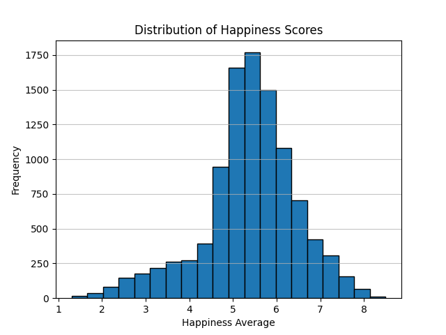
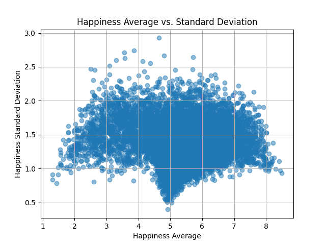
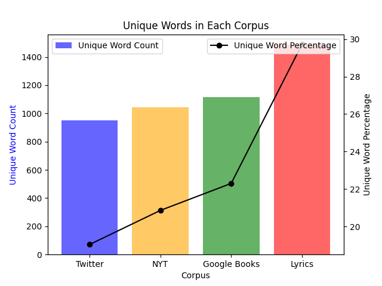
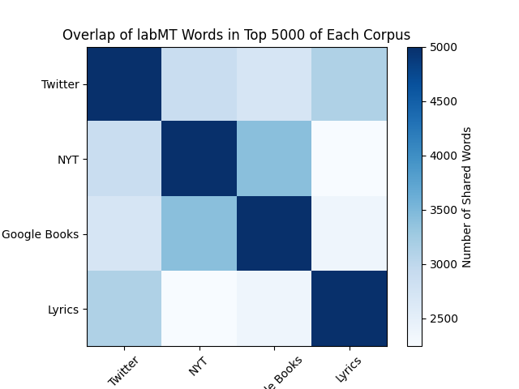
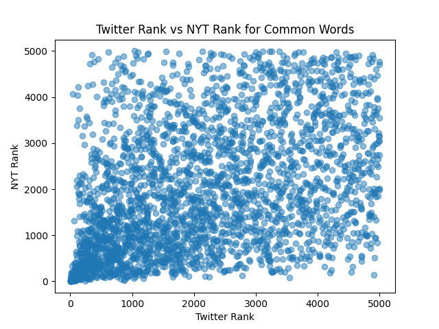

## Happiness According to Mechanical Turks:  
## Quantitative + Qualitative Exploration of the Hedonometer (labMT 1.0) Dataset
By applying quantitative and qualitative data analysis to labMT 1.0 dataset, we examine how accurate and reliable the results of their data collection are. In addition, we make suggestions about application of their research.

# Data

The file was loaded by reading a tab-delimited .txt dataset into a pandas DataFrame while skipping the first non-data rows and then converting the rank-related columns into numeric values. After loading, all "--" placeholders were replaced with proper missing values (NaN). The missing values indicate that these items were not counted in their respective ranks.

The dataset contains the 10222 rows and 8 columns.

## Data dictionary

| Column name | Representation | Type | Notes on missingness |
|:-----------:|:--------------:|:----:|:--------------------:|
| word        | Item Mechanical Turk 1.0 evaluated on the happiness scale | string | none |
| happiness_rank | How happy the word is considered by MT 1.0 | integer | none |
| happiness_average | The average of happiness ratings for a specific word | floating-point number | none |
| happiness_standard_deviation | The dispersion of happiness ratings around a specific word | floating-point number | none |
| twitter_rank | The sum of rankings that MT 1.0 assigned to Twitter posts | floating-point number | ??? |
| google_rank | The sum of rankings that MT 1.0 assigned to Google posts | floating-point number | ??? |
| nyt_rank | The sum of rankings that MT 1.0 assigned to New York Times posts | floating-point number | ??? |
| lyrics_rank | The sum of rankings that MT 1.0 assigned to lyrics of songs | floating-point number | ??? |

## Sanity checks

The data includes no duplicated words. This was checked with a Boolean mask, where values appearing only once were marked 'False' and those appearing several times 'True'. This resulted in an empty set, meaning no duplicate words were found in the list. 

15 random rows were selected from the dataframe. We used a fixed seed number (42!) for reproducibility reasons. On observation, nothing seemed out of the expected. 

A list of 10 most positive and 10 most negative words by happiness average was composed. Both tables have been added below.

### 10 most positive words
| # | Word | Happiness average |
|:-:|:----:|:-----------------:|
| 1. | laughter | 8.50 |
| 2. | happiness | 8.44 |
| 3. | love | 8.42 |
| 4. | happy | 8.30 |
| 5. | laughed | 8.26 |
| 6. | laugh | 8.22 |
| 7. | laughing | 8.20 |
| 8. | laughs | 8.18 |
| 9. | excellent | 8.18 |
| 10. | joy | 8.16 |

### 10 most negative words
| # | Word | Happiness average |
|:-:|:----:|:-----------------:|
| 1. | suicide | 1.30 |
| 2. | terrorist | 1.30 |
| 3. | rape | 1.44 |
| 4. | murder | 1.48 |
| 5. | terrorism | 1.48 |
| 6. | cancer | 1.54 |
| 7. | death | 1.54 |
| 8. | died | 1.56 |
| 9. | kill | 1.56 |
| 10. | killed | 1.56 |

As we can see from both lists, words with the same root occur throughout the spectrum. The original Hedonometer project treated these words as individual occurences due to each form having a slighthly different emotional score - for example 'happiness' feels positive to more people as it involves an unspecified number of participants (free-to all), whereas 'happy' implies a feeling for a single person or a specified group (can be free for all, but not necessarily). 

We consider "making sense" as a visible contrast between the most positive and most negative words. These make sense as the most positive section have words that indicate happiness: laughter, love, joy, excellent, and the negative words have dark words: suicide, murder, cancer, death. 

# RESULTS
# Quantitative exploration
## Distribution of happiness scores
  

The distribution is centered around between 5-6 with average standard deviation of 1.38.

The pattern that surprised us is that the frequency between 4 and 5,5 is very stark compared to difference between 5,5 and 7. Overall, more words are identified as positive in comparison to negative.

## Contested words

As the top 15 words with the most disagreement between observers (highest standard deviation) had a lot of root-related overlap, we have compounded them as such in order to explore the contrasts between meanings with different morphological endings.

| # | Word(s) | Possible reason for disagreement | Happiness Average | Happiness SD |
|:-:|:-------:|:--------------------------------:|:-----------------:|:-----------:|
| 1. / 2. / 3. / 8. | fucking/fuckin/fucked/fuck | Could be used in an angry context, as well as in a pleasure or excitement context, can also function as an 'amplifier'. | 4.64 / 3.86 / 3.56 / 4.14 | 2.9260 / 2.7405 / 2.7117 / 2.5794|
| 4. | pussy | Could be used in pleasure context, for a pussycat, or as an insult | 4.80 | 2.6650 |
| 5. | whiskey | Meaning depends on personal preference | 5.72 | 2.6422 |
| 6. | slut | Could be used in pleasure context, as well as an insult | 3.57 | 2.6300 |
| 7. / 10. | cigarettes/cigarette | Meaning depends on personal preference | 3.31 / 3.09 | 2.5997 / 2.5163 |

It is visible from the first root 'fuck' that morphological endings play a role while considering their happiness score. While the overall sentiment of this root remains fairly negative, words such as 'fucking' and 'fuck' seem to have slightly higher happiness average than the two other forms. The word 'fuckin' could be just a typo (missing the 'g' at the end) and therefore, while still used in similar contexts as 'fucking', it skews the data. It could, however, be a stylistic choice. 

Furthermore, 'fuck' derivations can work as a context amplifier, so their happiness value might be affected by the words preceding or following, resulting in a bleeding effect of bias. The standard deviation, therefore, illustrates an effect on context-sensitive words.

Words such as 'whisky' and 'cigarette'/'cigarettes' tend to hold a spectrum of opinions, depending on the personal and cultural differences. 'Whisky' displays an above-average happiness score of 5.72, while holding the 5th place in the top 15 words with the highest disagreement (SD = 2.6422). This could be due to views towards alcohol from different cultures, however we hypothesis the true reason might be the Great Whisky Shortage of 2013, where the demand for whisky outgrew the supply, resulting distilleries in lowering their proofs. These actions brought on major consumer backlash, possibly resulting in the word being used in negative contexts. 

Similar applies to 'cigarette'/'cigarettes', as the world was taking action towards smoking and the rise of the electronic cigarettes/vapes. 

As seen from the plot above, words near the neutral midpoint tend to have a lower standard deviation, meaning people agree more about neutral words, whereas words with a high positive or negative average show higher variability. This suggest that emotional words evoke more disagreement or context-dependent interpretation. 

## Corpus comparison

As seen from the image above, Twitter resulted as the corpus with the least amount of unique words, while Lyrics displayed the highest percentage of unique words. This could be credited towards creative or poetic language, that often does not play by grammatical rules (resulting in many derivational forms of the same root), as well as a broad topic of themes, resulting in a wide vocabulary.  

Google Books, our second ranking, similarly displays variety in unique items, consistent with long-form writing, followed shortly by New York Times. Possible difference is the journalistic clarity and conciseness.

Twitter displays the lowest unique-word percentage, possibly due to its short-message form and trending topics, leading to repetition of common words.

The heatmap above illustrates the vocabulary overlaps between corpora. Based on the deepness of the color indicated, Twitter and Lyrics share the most overlap among the top 5000 words. This is possibly due to the highly informal, conversational and emotionally expressive language, characteristic to both corpora.

Similarly, New York Times and Google Books overlap with each other due to more formal, standardized vocabulary. 

Twitter displays the lowest overlap with New York Times and Google Books, reflecting differences in style, register and topic. 

While Twitter can be categorized as an emotional and expressive corpora, and New York Times as a standardized one, some similarities remain. As seen on the scatterplot above, a cluster is forming on the lower left of the image, signifying that high-frequency words are common across both corpora. 

As the image is covered in scattered points, it is clear that both corpora are largely different, some words rank very highly in the Twitter corpora, whereas they are ranked low in the New York Times corpora and vice-versa. 

A word to illustrate this is 'lol', common in Twitter, where informal conversations and abbreviated expressions are the norm, however rare or absent in New York Times or Google Books, as these sources tend to maintain formal editorial standards.

# Qualitative exploration

The words chosen are 'hehehe', 'ipod', 'groovy', 'gr8' and 'thou'. These words were picked as they represent different time periods and language communities. 'groovy', 'ipod' and 'thou' were picked as they are older in terms of modernity, which can change emotional value overtime. 'hehehe' and 'gr8' were picked as they represent a more modern-time speaking, used mainly through online chats and social media. 

Word 1: The word "hehehe" is used as an informal way of laughing online, through games, social media, online chats, etc. Unlike it's family word "hahaha", "hehehe" is often used and seen as michevious or teasing. The happiness average is 7.08, being more positive in the rankings. The reason it can this high is because it signals playfulness or friendliness. This word is more commonly used with younger users. 

Word 2: For "ipod", the happiness average was 6.56. This is still ranked mostly positive, as people associate ipods with music, nostalgia, and relaxed moments. People may use this words when reminiscing, while others may associate it with the brand "Apple", which can be why it's leaning more towards neutral than overly positive. Those who grew up with ipods versus the younger generation who haven't used it would use and have emotion towards this word differently, while the younger generation doesn't have the same attatchment. 

Word 3: For word 3, "groovy" was ranked at 6.54, with a similar ranking to "ipod". This word can be used as "fun" or "cool", and associates with the 1960's and 70's. This word carries an upbeat vibe which can explain the higher positive score. Others may find this word to be cringey or old, which would lower the score. Those who grew up in the generation of it most used may use it more sincerely than those who didn't grow up in the 60's and 70's.

Word 4: "gr8" is a short way for texting 'great', most commonly used through texting, originating from SMS text character limit. Informal messaging and memes is where this word is most commonly used. As this word means 'great', the overall happiness score is ranked higher as 'great' is a positive word. The younger generation is more likely to use this, while more formal or older texters would use 'great'. 

Word 5: For 'thou', it is a dialect form of 'you', used in Early Modern English. It can be used in a parody way of people inmitating "old" English. The happiness score is neutral, but slightly more positive (5.14), this can be because it is used as a neutral word (you). The word itself does not carry any negative or positive content. Scholars and students may use this word in a Shakespearian way, while fantasy role-players (and anyone using it in this way) may use the word in a joking way, or for theatrics. "gr8" had an average happiness score of 6.26. 

# REFLECTION

The labMT 1.0 list was created using a quantitative methodology to measure the emotional value of commonly used English words. The pipeline is as follows:

Candidate word collection: The researchers selected high-frequency words from four large text corpus as candidates:
Twitter: informal social media language.
Google: a generalised sample of Google posts, representing written language.
New York Times: formal journalistic writing.
Lyrics: language of popular music containing emotional and cultural expressions.

The 5,000 most frequent words were taken from each corpus. We end up with a list of 10,222 unique words after merge and duplicate removal.

Recruit online human subjects by using Mechanical Turk 1.0. All subjects are required to rank each words from 1(saddest) to 9(happiest). To ensure the reliablility of rankings, every word will be ranked independently by multiple subjects.

Calculation of all scores for each word:
Mean happiness (happiness_average):  the average of happiness ratings for a specific word.

Standard deviation (happiness_standard_deviation): the dispersion of happiness ratings around a specific word.

According to the average score, all words are ranked from high to low, and the results is (happiness_rank). The more score the word obtained, the higher rank it will be(1 is the happinest score).

For each word, record seperately their ranks in their original corpus (twitter_rank, google_rank, nyt_rank, lyrics_rank). If the word was not in the top 5,000 words of a particular corpus, the rank was record as missing. 

All information was merged into a single tab separated file (labMT 1.0). The first rows are metadata rows, then there is a header row, and the data rows. This bestet will serve as the basis for the “hedonometer”.

## Consequences of design

1: Only obtained the happiness ratings from human sobservers on Mechanical Turk 1.0. 

Consequence: Since we cannot confirmed that the human subjects on the Mechanical Turk 1.0 platform include people from all cultures around the world, it is not possible to have an answer that represents the emotions of humans regarding language on a global scale.

Example: Words such as “whiskey” and “cigarettes” show high standard deviations in the data. This may be because, across different cultural contexts, the meanings these words convey and the emotions of those who use them are not necessarily consistent, leading to conflicting scores for these terms.

2: Using a simple 1-to-9 rating scale to evaluate the sentiment associated with different words may obscure many of people’s neutral emotions.

Consequence: This simplistic rating scale risks simplifying people’s complex emotions, reducing feelings that cannot be quantified into a limited numbers. Furthermore, some neutral words are directly assigned a mid-range score of around 5, even though these words may contain no emotional thoughts at all.

Example: Words such as “the” and “and” have average scores of around 5.22–5.24, which is close to 5. However, they carry almost no emotion in language, and such a rating could be confusing us to think they are slightly positive or negative.

3: extracted the top 5,000 most frequent words from each of the four corpora, merged them, and removed duplicates to obtain the final vocabulary list.

Consequence: Some low-frequency words are also meaningful, but they were excluded because only the top 5,000 words from a limited corpus were extracted. Furthermore, since the corpus comprises only four distinct types, it cannot cover all areas of language that people used in daily life, so some words simply have no chance of appearing in the dataset.

Example: “hahaha” is widely used in Twitter and lyrics, but it is not found at all in the nyt collection. This means normally news almost never has such sound imitations; so the score of this word(7.94) is only based from its use in informal and musical language. 

4: One word only obtained one average score, completely ignoring a word's multiple meanings across different contexts.

Consequence: Some words are positive in one context but negative in another, yet the dataset can only provide a single average score, resulting in a high standard deviation for certain words.

Example: Words such as “fucking” and “fucked” have extremely high standard deviations (>2.5), indicating that they can be used to express both negative emotions and excitement. The dataset’s single average score (approximately 4.64) cannot distinguish between these two distinctly different uses.

5: The data was collected in 2011.

Consequence: 2011 is the time when this data sets is collected, which is too early; it can only reflect the state of language use and emotional perception at that time. In this period, some words may already changed their meanings and can’t reflect the emotions of people accurately anymore.

Example: Words like “groovy” (average score of 6.54) were popular in the 1970s and carry positive emotions, but they may have become less common after 2011. When analyzing recent Twitter text, the frequency of this word is extremely low.

## Instrument note

1. We believe this dataset can measure the overall emotional trends of internet users toward high-frequency English words. It is capable of identifying strongly positive and negative words. It is very useful for tracking overall emotional trends in corpora such as Twitter and song lyrics.

2. What would I refuse to claim based on it:
We believe these scores do not apply to all situations. They do not take into account cultural differences, shifts in meaning, or consider context. Any claim that a text is “happy” simply because it scored highly is more like a rough estimate rather than an accurate interpretation.

3. What improvements would I make if I rebuilt it:
If we would rebuild it today, we would:

Choose human subjects from different cultures and regions;

Gather ratings in short sentences to see the effect of context;

Provide “neutral” button to prevent scoring of function words;

Add contemporary slang and a few tail words to the word list. Through that to update the dataset to monitor semantic drifts. For example, consider to add the data set from Reddit or Tiktok;

Use full rating distributions rather than just average numbers;
These changes would make the instrument more detailed, more fit to the global culture, and more accurate to daily life in different period. 

 ### Setup Steps
 #### 1. Create virtual environment (.venv) 
 python -m venv .venv
 #### 2. Start .venv 
 ##### On Windows (PowerShell):
.\.venv\Scripts\Activate

##### On macOS / Linux:
source .venv/bin/activate

 #### 3. Install requirements
pip install -r requirements.txt

### Scripts to run
##### Task 1.1: python src/Task_1.1.py
##### Task 1.2: python src/Task_1.2.py
##### Task 1.3: python src/Task_1.3.py
##### Task 2.1: python src/Task_2.1.py
##### Task 2.2: python src/Task_2.2.py
##### Task 2.3: python src/Task_2.3.py
##### Task 3.1: python src/Task_3.1.py

 # CREDITS
Repo and workload lead - Elze  
Data wrangler - Asena  
Qualitative analyst - Stan  
Quantitative analyst - Meeli  
Provenance and critique lead - Bijia

