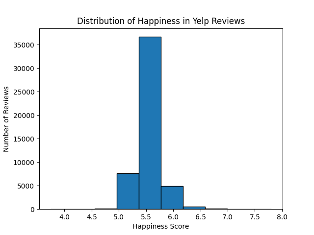
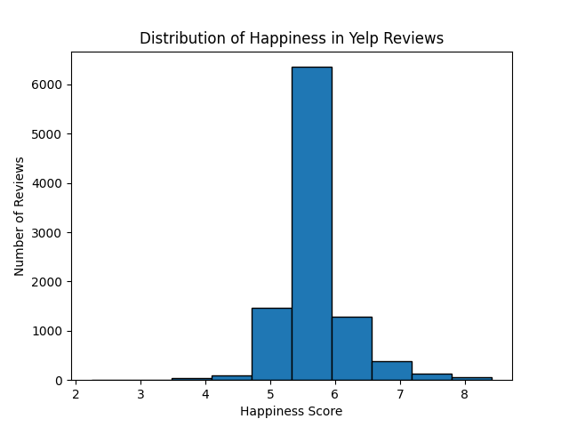

# Hedonometer on Yelp: Are Tips Happier than Reviews? 

## Project Overview
We are using the labMT 1.0 hedonometer to compare the two different types of tones through Yelp tips and Yelp reviews. For this, we are answering if yelp tips are systemically happier, according to the hedonometer, than Yelp reviews. 

The original data count is 6,990,280 total for reviews and 908,915 total for tips. As the original data set is very large, we condensed the data set to 5,000 reviews and 5,000 tips by using a script that randomly sampled N lines from each of the files.  

<<<<<<< HEAD
## Data (name for now)


## Quantative Analysis (name for now)

### Analyzing Yelp reviews with hedonometer
We applied hedonometer to texts entries in Yelp reviews (find it in src/Yelp_hedonometer_analysis). The results gave us a histogram, which shows the distribution of 'happiness' rankings among text entries in the app. As it is displayed in histogram, all of the rankings are equally distributed among the middle rankings, which means that people show neither very unhappy, nor very happy characteristics in their comments.

=======
## Analyzing Yelp reviews and tips with hedonometer
We applied hedonometer to texts entries in Yelp reviews and tips(find it in src/Yelp_hedonometer_analysis). The results gave us a histogram, which shows the distribution of 'happiness' rankings among text entries in the app. As it is displayed in histogram, all of the rankings are equally distributed among the middle rankings, which means that people show neither very unhappy, nor very happy characteristics in their comments.

>>>>>>> 9fe4e663ec6050d681f9d3b8d9074b20535302d6

# How to download the Yelp Dataset
We get the Yelp Dataset through Kaggle API, which then stores the raw files into data/raw/. You can access the website for the Yelp Dataset (and to make an account) at this link: https://www.kaggle.com/datasets/yelp-dataset/yelp-dataset

### Configure Kaggle credentials (one‑time, per machine)

1. Log in on Kaggle → go to Account → Settings → Legacy API Credentials.

2. Click “Create Legacy API Key”. Your browser will download a file called kaggle.json.

3. On your computer, create the folder:

    C:\Users\<your‑username>\.kaggle\

4. Move kaggle.json into that folder so you have:

    C:\Users\<your‑username>\.kaggle\kaggle.json

*This file is your personal Kaggle API credential. Do NOT commit it to Git.*

### Install the Kaggle CLI

1. From the project root (for example C:\Users\yourname\Desktop\coding-humanities\Hedonometer):

``` 
pip install kaggle 
kaggle --help
```

*If the help text appears, the CLI is installed correctly.*

### Download the Yelp dataset into data/raw/ 
1. (write this in the terminal)

```
kaggle datasets download -d yelp-dataset/yelp-dataset -p data/raw
```

2. After this, check it's inside the correct folder

```
dir data\raw
```

### Unzip the dataset 
1. Navigate to Hedonometer\data\raw
2. Right‑click yelp-dataset.zip → Extract All... (into the same folder)
3. Choose Hedonometer\data\raw as the destination.

After extraction, data/raw/ should contain files such as:

    yelp_academic_dataset_review.json
    yelp_academic_dataset_business.json

### Run Scripts 
```
process_yelp_from_kaggle.py
```

```
process_yelp_tips.py
```

```
yelp_lower_sample_count.py
```

## How to Git Commit correctly 

1. From the project root (example: C:\Users\yourname\Desktop\coding-humanities\Hedonometer)

```
git status
```

2. Only add files that should be in the repo:

```
    Code: src/*.py

    Config: requirements.txt, .gitignore

    Documentation: README.md

    Processed data: files in data/processed/ (e.g. yelp_reviews_processed.csv)
```
**Do NOT add raw files from Kaggle (example: data/raw/yelp_academic_dataset_*.json), these are ignored in .gitignore**

*Example*
```git add src/process_yelp_from_kaggle.py
git add data/processed/yelp_reviews_processed.csv
git add README.md
git add requirements.txt
git add .gitignore
```
3. Commit with a message 
```
git commit -m "Added yelp reviews processed"
```
4. Push 
```
git push
```


