# Hedonometer on Yelp: Are Tips Happier than Reviews? 

## Project Overview
We are using the labMT 1.0 Hedonometer assigned happiness average scores to research which of the two is happier in their nature: Yelp reviews or Yelp tips. 

Secondary research questions we will be attempting to answer are:

- Does semantic prosody of the words preceding and following highly and lowly rated words show correlation in their respective marks? 
- Does a correlation exist between reviews with high average happiness scores and high star-ratings? 


## Background 


### The basis for the Hedonometer
The labMT 1.0 list was created using a quantitative methodology to measure the emotional value of commonly used English words. The pipeline is as follows:

The researchers selected high-frequency words from four large text corpus as candidates: 
- Twitter: informal social media language. 
- Google: a generalised sample of Google posts, representing written language. 
- New York Times: formal journalistic writing. 
- Lyrics: language of popular music containing emotional and cultural expressions.
The 5,000 most frequent words were taken from each corpus. The results end up with a list of 10,222 unique words after merge and duplicate removal.

THIS SECTION NEEDS TO BE REWRITTEN:
Dataset construction (labMT 1.0)
The labMT 1.0 dataset was built by the original hedonometer researchers using the following procedure:

1. Score collection
Recruit online human subjects by using Mechanical Turk 1.0. All subjects are required to rank each words from 1 (very negative) to 9 (very positive). To ensure the reliablility of rankings, every word will be ranked independently by multiple subjects.


2. Calculation
Calculating every words：
-Mean happiness (happiness_average): The average of happiness ratings for a specific word.
-Standard deviation (happiness_standard_deviation): The dispersion of happiness ratings around a specific word. 

3. The rule of ranking
-According to the average score, all words are ranked from high to low, and the results is (happiness_rank). The more score the word obtained, the higher rank it will be(1 is the happiest score).<br>

4. The way of recording words
-For each word, record separately their ranks in their original corpus (twitter_rank, google_rank, nyt_rank, lyrics_rank). If the word was not in the top 5,000 words of a particular corpus, the rank was recorded as missing.<br>

5. finalised
-All information was merged into a single tab separated file (labMT 1.0). The first rows are metadata rows, then there is a header row, and the data rows. This set will serve as the basis for the “hedonometer”. 

This dataset forms the basis for our analysis in this project. In this project, we used the happiness_average to be preliminary project to score each word. With this being preliminary project, we are able to compare groups of words (so for us, tips vs. reviews). By matching the Yelp dataset to the the labMT, we are able to get the happiness scores for both tips and reviews, compare the happiness_average, and see how context drives difference and through which specific words. The labMT does has it's limitations, such as context, which we will explain in the limitations section. 


### The basis for Yelp datasets

Yelp dataset was acquired via Kaggle. We worked with two seperate datasets: Yelp reviews and Yelp tips, out of which the first was focused on overall experience, and the latter oriented towards specific, quick advice.

The original data count was 6,990,280 items for reviews and 908,915 items for tips. As the original dataset proved to be too large, we condensed it to 5,000 reviews and 5,000 tips by using a script that randomly sampled N lines from each of the files.  

Both corpora were pre-processed to remove noise, such as punctuation, non-alphabetic characters and irregular spacing. All text was tokenized, ensuring consistent lower-casing and removal of non-word tokens.


## Data & Methods

To assess the suitability of the Hedonometer lexicon for Yelp data, we compared the vocabulary of both corpora to the lexicon's word list. 

We did this by extracting all unique words, which were then compared against the Hedonometer vocabulary. Words present in Yelp but absent from the Hedonometer lexicon were counted. Both tips and reviews contained substantial numbers of out of vocabulary words (reviews 11229, tips 2925), these included domain-specific terms (food items, brands), proper nouns (restaurant names, locations) and possible misspellings/morphological variants. 

!!! Insert here calculations/tables on word level !!!

Next to calculating sentiment at the word level, we computed average happiness per review or tip, treating each item as a meaningful unit of user expression. As mentioned above, all text was tokenized into individual words and matched to their corresponding happiness scores. The item's happiness score was calculated as the mean of all matched word scores. 

| Kind | Mean | SD | 50% | 75% | max |
|------|------|----|-----|-----|-----|
| Review | 5.579043 | 0.215035 | 5.559418 | 5.690538 | 7.207273 |
| Tip | 5.836699 | 0.630054 | 5.783667 | 6.160000 | 8.440000 |

The mean length of a Yelp tip was 10.9612 words per item (SD = 10.4601), the mean length of a Yelp review was 106.2226 words per item (SD = 104.2296). 

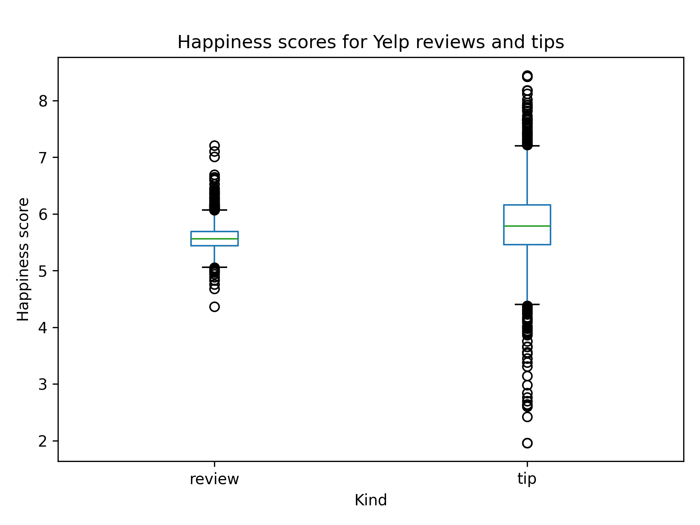

Yelp tips exhibited higher average happiness and greater variance.

Yelp reviews showed lower average happiness and a more constrained distribution.

This aligns with genre expectations - tips are short, often informal and used to highlight positive experiences, whereas reviews tend to be longer, are more narrative and more likely to contain mixed or critical evaluations.

Our primary research question asks whether Yelp tips are happier than reviews. At first, this seems like a question that can be answered simply by comparing average happiness scores per item - and indeed, the results show that tips are on average more positive.

However, sentiment in natural language is rarely uniform. A text can contain highly positive words embedded in neutral or even negative contexts, and vice versa. This is where semantic prosody becomes essential. Semantic prosody examines how the emotional tone of a word is shaped by the words that surround it. By studying the immediate neighbours of the happiest words in Yelp, we gain insight into how sentiment is actually used, not just how it appears in isolation. 

The following segment will explore how tips and reviews use positive words differently. Tips might contain more positive words overall, however, they might use them in a straightforward, uniform contexts ("I love this place"), while reviews might embed the same words in contrastive or mixed context ("Loved the food, but the service was slow"). 

## Semantic Prosody

We first computed word frequencies over the combined Yelp reviews and tips corpus using a tokenizer restricted to alphabetic tokens in lowercase. These frequencies were then joined with the Hedonometer (labMT) lexicon. From this intersection we selected the top 15 happiest words, that appear in Yelp corpus and occur at least 20 times, ensuring sufficient contextual evidence for each target word.

We then extracted its immediate left and right neighbours for every occurance of each target word in the top 15 happiest words. If a neighbour existed and was present in the Hedonometer lexicon, we mapped it to its happiness score. This yielded a list of happiness scores representing the emotional tone of its local context.

For each of the 15 target words, we computed the average happiness of all collected neighbours. This produced a single contextual sentiment value per word, which could be directly compared to the word's own happiness score.

### Top 15 happiest words (Yelp reviews) with their neighbour average.

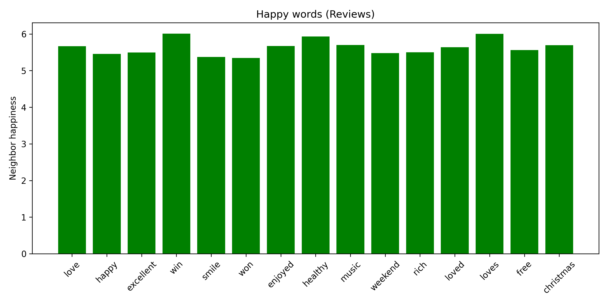
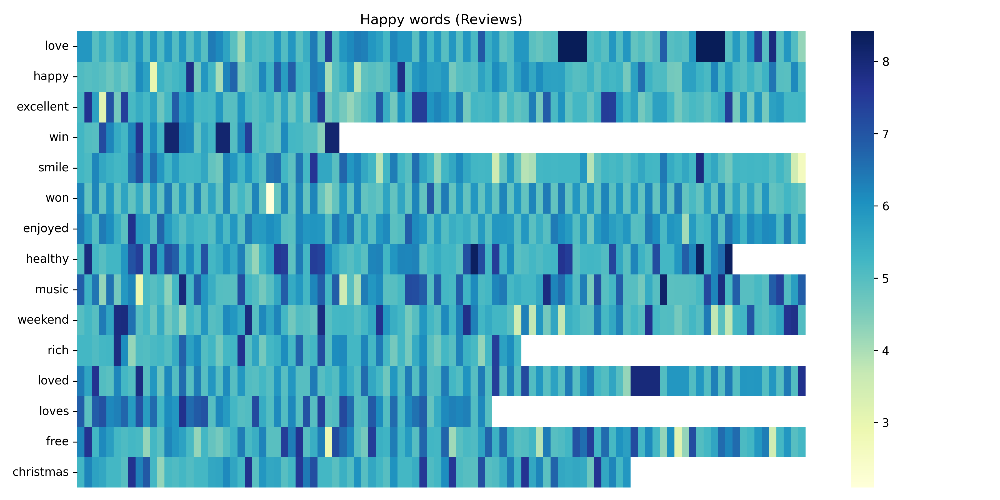

| # | Word | Happiness Average | Neighbor Happiness Average |
|---|------|-------------------|----------------------------|
|1.| love | 8.42 | 5.67 |
|2.| happy | 8.30 | 5.45 |
|3.| excellent | 8.18 | 5.49 |
|4.| win | 8.12 | 6.01 |
|5.| smile | 8.10 | 5.37 |
|6.| won | 8.10 | 5.34 |
|7.| enjoyed | 8.02 | 5.67 |
|8.| healthy | 8.02 | 5.93 |
|9.| music | 8.02 | 5.70 |
|10.| weekend | 8.00 | 5.48 |
|11.| rich | 7.98 | 5.50 |
|12.| loved | 7.96 | 5.64 |
|13.| loves | 7.96 | 6.00 |
|14.| free | 7.96 | 5.56 |
|15.| christmas | 7.96 | 5.69 |

### Top 15 happiest words (Yelp tips) with their neighbour average.

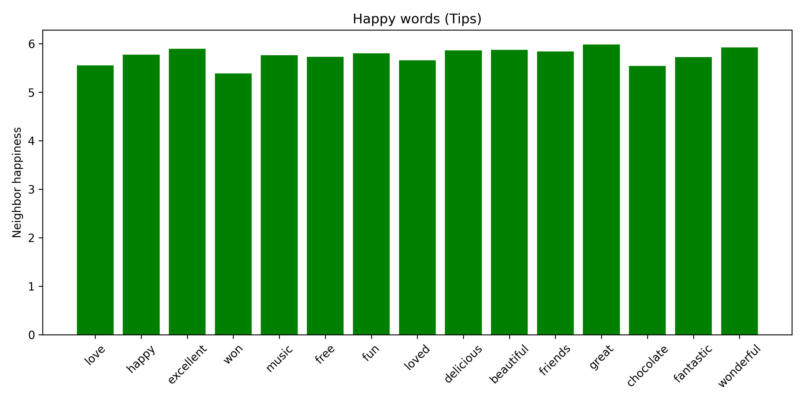
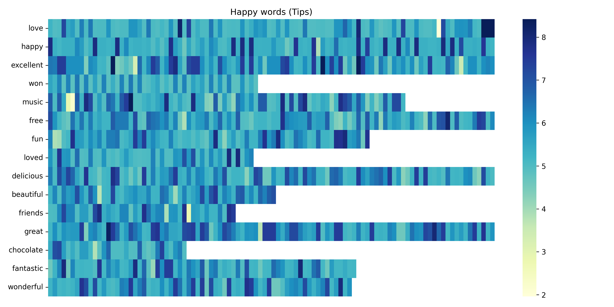

|#| Word | Happiness Average | Neighbor Happiness Average |
|-|------|-------------------|----------------------------|
|1.| love | 8.42 | 5.55 |
|2.| happy | 8.30 | 5.77 |
|3.| excellent | 8.18 | 5.89 |
|4.| won | 8.10 | 5.39 |
|5.| music | 8.02 | 5.76 |
|6.| free | 7.96 | 5.73 |
|7.| fun | 7.96 | 5.80 |
|8.| loved | 7.96 | 5.66 |
|9.| delicious | 7.92 | 5.86 |
|10.| beautiful | 7.92 | 5.87 |
|11.| friends | 7.92 | 5.84 |
|12.| great | 7.88 | 5.98 |
|13.| chocolate | 7.86 | 5.54 |
|14.| fantastic | 7.78 | 5.72 |
|15.| wonderful | 7.76 | 5.92 |

As seen from above, some highly positive words, such as love (8.42), happy (8.30) and excellent (8.18) occur in contexts whose average neighbor happiness is substantially lower (typically around 5.30-5.90). This pattern applies to both tips and review type items, indicating that strongly positive lexical items are embedded in more moderately positive or neutral linguistic surroundings. Scatterplots (see figures below) confirm that, while there is a generally positive association, neighbor scores cluster in a narrower, mid-positive band, suggesting that highly positive words function as local affective peaks within otherwise less extreme contexts.


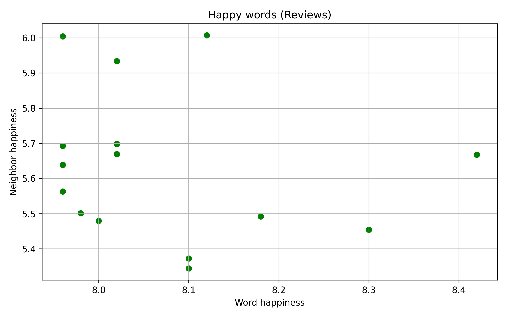
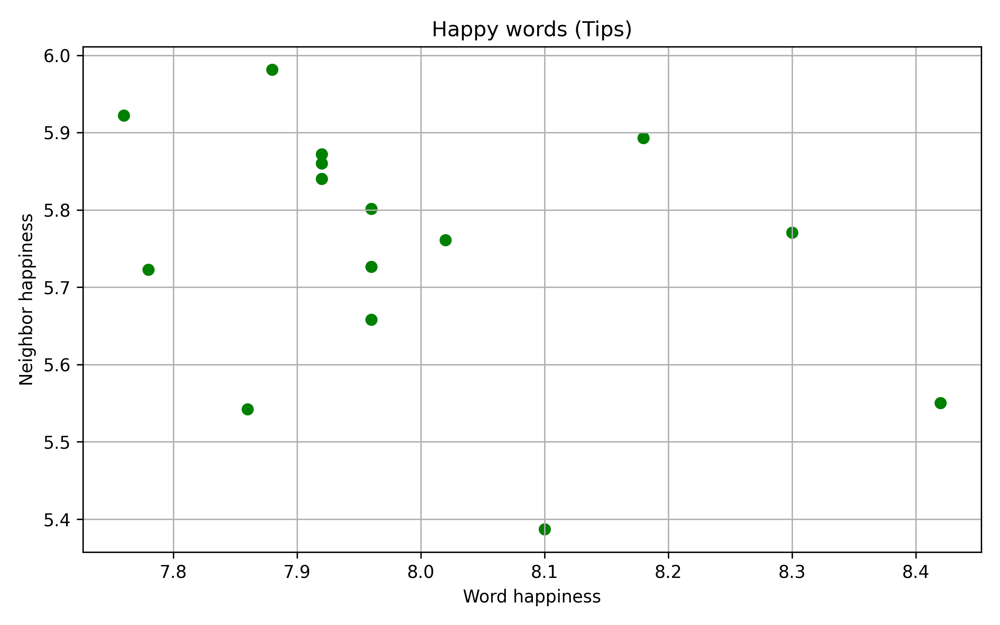

For unhappy words, we applied the same procedure to the 15 lowest-scoring words in both reviews and tips.


### Top 15 unhappiest words (Yelp reviews) with their neighbour happiness average.

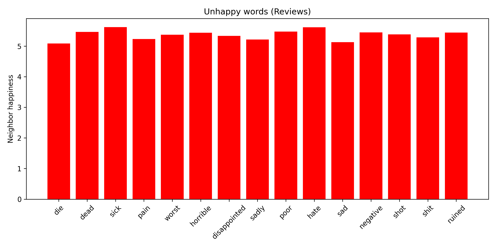
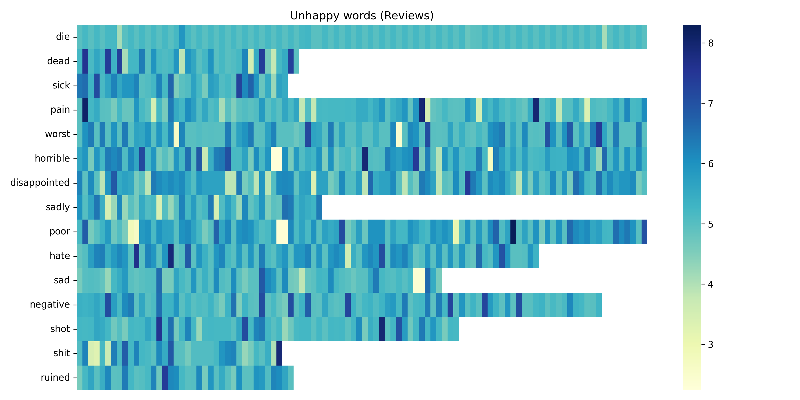

|#| Word | Happiness Average | Neighbor Happiness Average |
|-|------|-------------------|----------------------------|
|1.| die | 1.74 | 5.09 |
|2.| dead | 2.00 | 5.46 |
|3.| sick | 2.02 | 5.62 |
|4.| pain | 2.10 | 5.23 |
|5.| worst | 2.10 | 5.37 |
|6.| horrible | 2.24 | 5.44 |
|7.| disappointed | 2.26 | 5.33 |
|8.| sadly | 2.28 | 5.22 |
|9.| poor | 2.32 | 5.48 |
|10.| hate | 2.34 | 5.62 |
|11.| sad | 2.38 | 5.13 |
|12.| negative | 2.42 | 5.45 |
|13.| shot | 2.50 | 5.38 |
|14.| shit | 2.50 | 5.29 |
|15.| ruined | 2.54 | 5.44 |

### Top 15 unhappiest words (Yelp tips) with their neighbor happiness average.

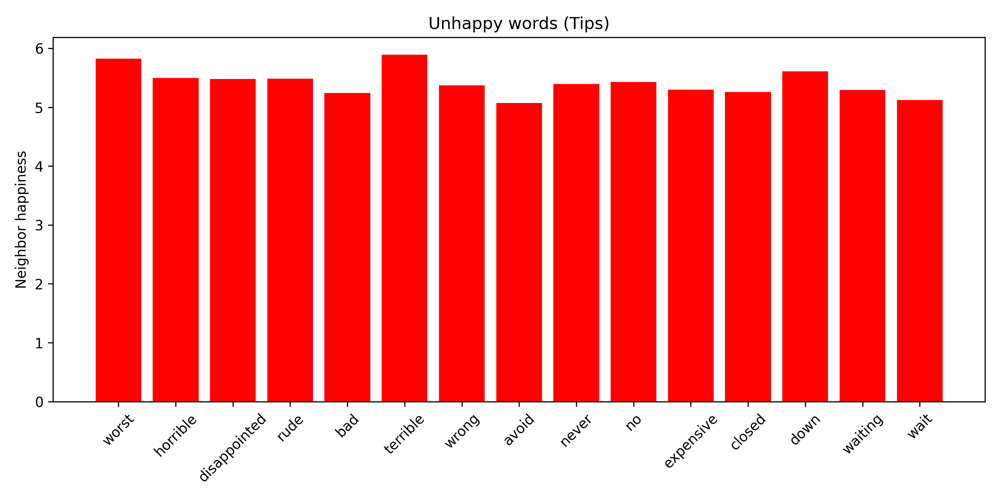
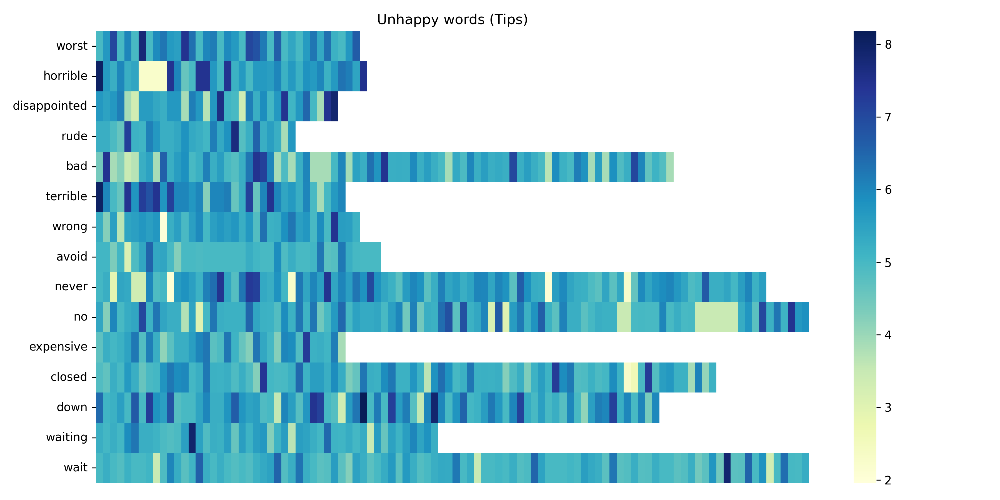

|#| Word | Happiness Average | Neighbor Happiness Average |
|-|------|-------------------|----------------------------|
|1.| worst | 2.10 | 5.83 |
|2.| horrible | 2.24 | 5.50 |
|3.| disappointed | 2.26 | 5.48 |
|4.| rude | 2.62 | 5.49 |
|5.| terrible | 2.84 | 5.89 |
|6.| wrong | 3.14 | 5.37 |
|7.| avoid | 3.14 | 5.07 |
|8.| never | 3.34 | 5.39 |
|9.| no | 3.48 | 5.43 |
|10.| expensive | 3.54 | 5.30 |
|11.| closed | 3.66 | 5.26 |
|12.| down | 3.66 | 5.61|
|13.| waiting | 3.68 | 5.29 |
|14.| wait | 3.74 | 5.12 |
|15.| 

Similarly to their positive counterparts, the strongly negative words such as die (1.74; 5.09), dead (2.00; 5.46) and worst (2.10; 5.37) appear in contexts whose average neighbor happiness hovers around 5.20-5.60. This remains similar in both reviews and tips and indicates that even strongly negative lexical items are embedded in contexts that are not uniformly negative, but instead mix evaluative language with more neutral descriptive content.

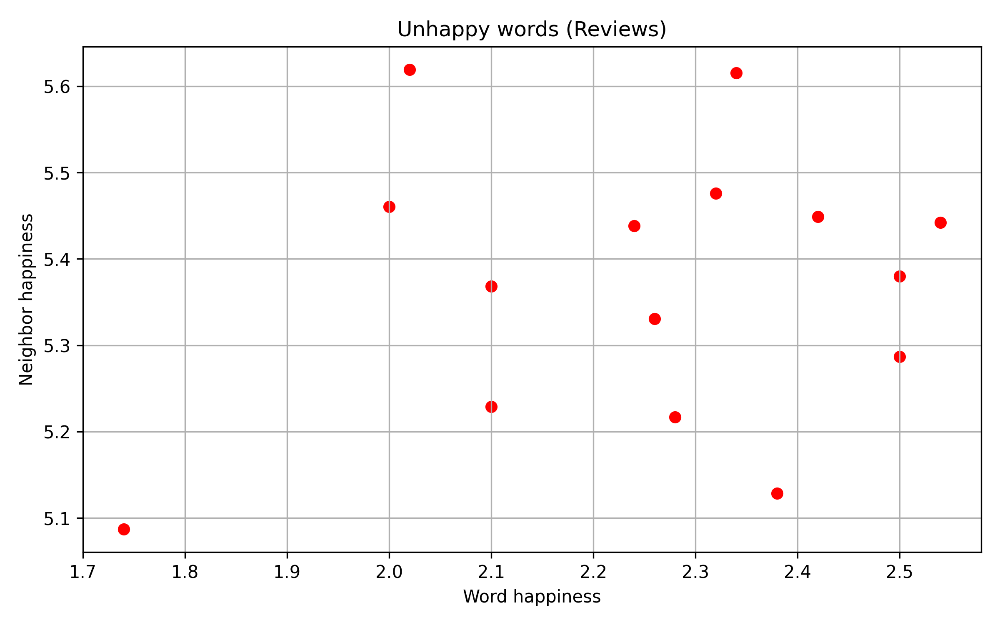
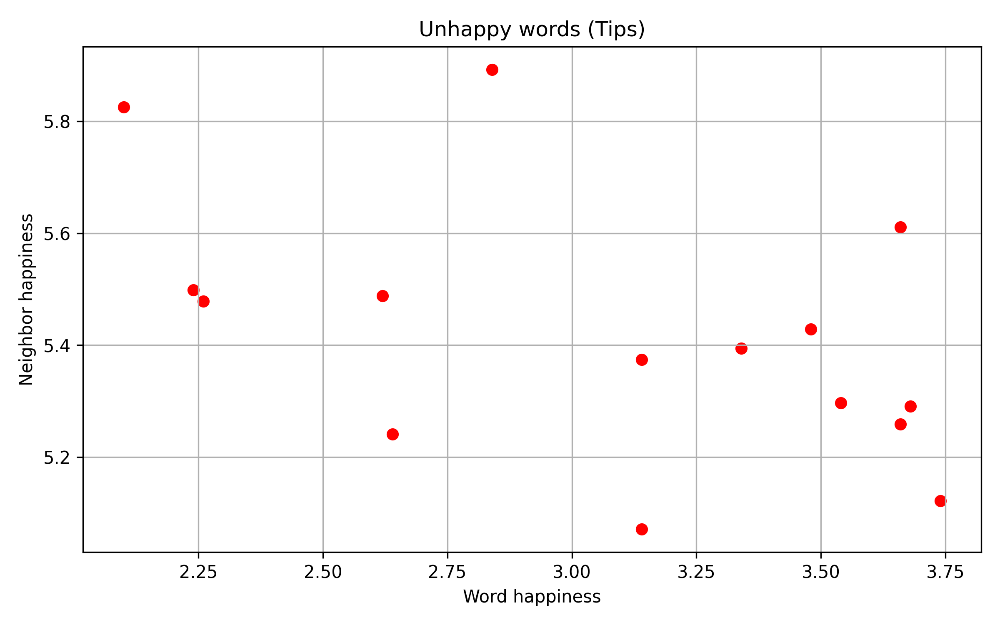

Taken together, these results illustrate a characteristic asymmetry between word-level valence and local contextual valence: both highly positive and highly negative words tend to appear in contexts whose average happiness is closer to the center of the scale.

By comparing reviews and tips seperately, we can also observe genre-specific tendencies: tips feature more concise, directive language but still show the same pattern of affective spikes (words such as great, fantastic, wonderful, worst, terrible) embedded in relatively moderate contexts.

## Quantitative Analysis: Results

### Bargraph 
We randomly sampled 5,000 Yelp reviews and Yelp tips and created a hedonometer happiness score by using the labMT 1.0 word list. The results show that tips are happier on average than reviews, by having a score of 5.80 and reviews having 5.54. The difference is 0.26 points, with the whole scale being 1-9. This shows quantitative evidence that answers our question if Yelp tips are systematically happier than Yelp reviews, through 5,000 randomly sampled reviews and tips. 

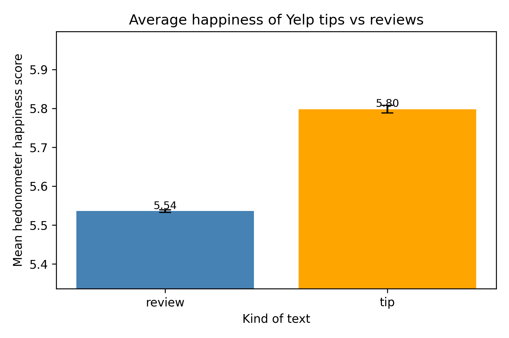

### Analyzing Yelp reviews and tips: words

We now know that tips have a higher average happiness score than reviews. To better understand where this difference comes from, we examine which hedonometer words are repeated most often between tips and reviews, and how positive or negative these words are. 

For each kind of text, we used the labMT happiness scores and listed the 15 most frequent positive words and the 15 most negative words. Because we always show 15 words per category, this analysis does not tell us whether tips use more positive words overall than reviews. Rather, it will help us better understand which specific positive and negative words drive the higher happiness scores for tips (as seen in the bargraph), and how often they are repeated. 


#### Reviews
##### Top positive (reviews):
| word  | count  | happiness|                       
| ------------- | ------------- | ------------- |
|   love   |    756    |    8.42| 
|   happy  |    308  |   8.30    |
|   excellent   |343    | 8.18|
|   win     |   21  | 8.12|
|   smile   |   51  |  8.10|
|   won     |   202 |   8.10|
|   enjoyed |   240 |   8.02|
|   healthy |   52  |   8.02|
|   music   |   144  |   8.02|
|   weekend |   109  |   8.00|
|   rich    |     36    |       7.98|
|   loved   |    252    |       7.96|
|   loves   |     29    |       7.96|
|   free    |    250    |       7.96|
|   christmas   |     39|       7.96|

Yelp reviews use strong positive words [love, happy, excellent] with these scores all between 8.18-8.42, with 'love' having the highest score of 8.42. There are multiple 'love' words such as 'love', 'loved' and 'loves' (as well as 'excellent', which is not part of the 'love' family, but is still a word that expresses emotion). This shows that people share their experience through these emotional terms. There are other words that express the experience such as 'music', 'weekend' and 'healthy'. These words are in the lower amount of counts from 52-250. These are not large amounts (especially compared to 'love' 'happy' and 'excellent' which all have 300-756 mentions) but can came in handy when comparing this with the tips. There are 10 words that reached a score of 8.00 or higher, and 5 words that had lower than 8.00. 

##### Top negative (reviews):
| word  | count  | happiness| 
| ------------- | ------------- | ------------- |
|die|     54|       1.74|
|dead|     22|       2.00|
|sick|     20 |      2.02|
|pain|     62|       2.10|
|worst|    127|       2.10|
|horrible|    131|       2.24|
|disappointed|    213|       2.26|
|sadly|     24|       2.28|
|poor|    102|       2.32|
|hate|     42|       2.34|
|sad|     33|       2.38|
|negative|     47|       2.42|
|shot|     37|       2.50|
|shit|     20|       2.50|
|ruined|     20|       2.54|

The negative Yelp reviews considerably strong negative words; worst, die, cancer, horrible. With the lowest happiness_average score being 1.74 for the word 'die'. Just like the positive reviews, negative reviews used words to express their emotions such as 'sad' (2.38), 'hate'(2.34) and 'disappointed' (2.26) and words to describe their experience such as 'worst' (2.10), 'horrible' (2.24) and ruined (2.54). These words show us that the negative reviews were more than just light complaints, but intense negative reviews and 'disappointed'. Something to note is the most counted word was 213 (for the word disappointed), which is significantly less than the most used word for the positive word (being 756 for the word 'love').


#### Tips
##### Top positive (tips):
| word  | count  | happiness| 
| ------------- | ------------- | ------------- |
|happiness|    145|       8.44
|love|  48097|       8.42|
|happy|  13589|       8.30|
|laughed|     56|       8.26|
|laugh|    130|       8.22|
|laughing|     62|       8.20|
|excellent|  21647|       8.18|
|laughs|     56|       8.18|
|joy|    219|       8.16|
|successful|     54|       8.16|
|win|   1078|       8.12|
|won|   5137|       8.10|
|smile|    799|       8.10|
|rainbow|    146|       8.10|
|pleasure|    363|       8.08|

Yelp tips have very positive words, 'love', 'happy', 'joy', 'beautiful', 'pleasure' all for example. The highest happiness score is 'happiness' with a 8.44. However, the most used word is 'love' with 48,097 uses and a 8.42 score. There is a 'laugh' family with 'laugh' (8.22), 'laughed' (8.26), 'laughing' (8.20) and 'laughs' (8.18). Not in this family but similar are 'happiness' and 'joy', which shows the playful and enthusiastic tone used throughout the Yelp tips. There are also words that show success, such as 'win' (8.12), 'won' (8.10), and successful (8.16). This fits in with tips as it's recommending things thats worth it. 

##### Top negative (tips):
| word  | count  | happiness| 
| ------------- | ------------- | ------------- |
|murder|     34|       1.48|
|death|    176|       1.54|
|cancer|    102|       1.54|
|kill|    259|       1.56|
|killed|    103|       1.56|
|died|    126|       1.56|
|torture|     33|       1.58|
|arrested|     25|       1.64|
|killing|    107|       1.70|
|die|   2815|       1.74|
|jail|     26|       1.76|
|kills|     54|       1.78|
|war|    130|       1.80|
|cry|     91|       1.84|
|failed|    149|       1.84|

The negative tips are incredibly negative, with words such as 'murder' (1.48), 'death' (1.54), 'kill' (1.56) and 'war' (1.80). Some of these words could be used as hyperboles, such as "This food is to die for" or "i'd kill for this food", which is why context does play a part in truly understanding, however this will be discussed more in limitations. 'die' appeared the most with 2815 occurances, which again could suggest the hyperbole sentences. Overall, the negative words appear less frequent than the positive tips and depending on context many could be metaphorical. 

 

### Star Rating vs. Happiness Score

To explore whether higher star ratings correspond to happier text, we plotted each review’s star rating against its hedonometer happiness score. The scatter plot shows a clear positive trend: reviews with more stars tend to have higher happiness scores.

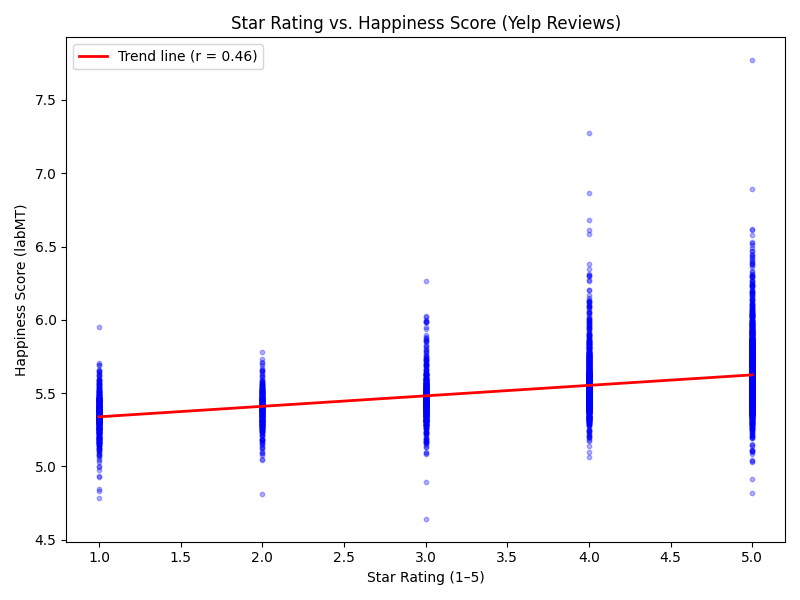

The correlation coefficient is **r = 0.46**, with a p-value < 0.001, indicating a statistically significant relationship. This suggests that people’s numerical ratings align well with the emotional tone of their written reviews.

To assess the stability of this correlation, we performed bootstrap resampling (1000 iterations). The 95% confidence interval for the correlation coefficient is **[0.438, 0.479]**, confirming that the positive relationship between star rating and happiness score is robust to sampling variation.

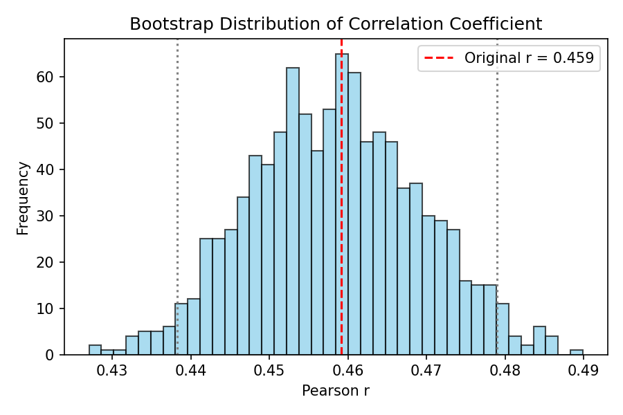

## Limitation & Reflection

### Notes on bias of the Hedonometer
1: Only obtained the happiness ratings from human observers on Mechanical Turk 1.0.<br>
Consequence: Since we cannot confirmed that the human subjects on the Mechanical Turk 1.0 platform include people from all cultures around the world, it is not possible to have an answer that represents the emotions of humans regarding language on a global scale.<br>


2: Using a simple 1-to-9 rating scale to evaluate the sentiment associated with different words may obscure many of people’s neutral emotions.<br>
Consequence: This simplistic rating scale risks simplifying people’s complex emotions, reducing feelings that cannot be quantified into a limited numbers. Furthermore, some neutral words are directly assigned a mid-range score of around 5, even though these words may contain no emotional thoughts at all.<br>

3: extracted the top 5,000 most frequent words from each of the four corpora, merged them, and removed duplicates to obtain the final vocabulary list.<br>
Consequence: Some low-frequency words are also meaningful, but they were excluded because only the top 5,000 words from a limited corpus were extracted. Furthermore, since the corpus comprises only four distinct types, it cannot cover all areas of language that people used in daily life, so some words simply have no chance of appearing in the dataset.<br>

4: One word only obtained one average score, completely ignoring a word's multiple meanings across different contexts.<br>
Consequence: Some words are positive in one context but negative in another, yet the dataset can only provide a single average score, resulting in a high standard deviation for certain words.<br>

5: The data was collected in 2011.<br>
Consequence: 2011 is the time when this data sets is collected, which is too early; it can only reflect the state of language use and emotional perception at that time. In this period, some words may already changed their meanings and can’t reflect the emotions of people accurately anymore.

### Reflection

In conclusion, our hypothesis that tips are rated happier than reviews is correct: tips scored an average happiness of 5.80 compared to 5.54 for reviews, a difference of 0.26 points on the 1–9 scale. This gap aligns with the genres' communicative purposes. Tips are short, purpose-driven, and highlight what to do or try at a venue, naturally with more positive framing. Reviews, by contrast, are longer, providing space for mixed assessments, criticism, and, therefore, for more negative emotions. The star rating analysis reinforces this: the moderate but statistically significant correlation (r = 0.46, p < 0.001) confirms that written sentiment generally tracks numerical ratings. Semantic prosody analysis revealed a consistent pattern across both genres: highly positive and highly negative words alike tend to appear in contexts of moderate happiness. This suggests that affective peaks, whether joyful or critical, function as local spikes within otherwise neutral or mixed linguistic surroundings, rather than as markers of uniformly extreme texts. Tips showed slightly more consistently positive surrounding context for their happiest words, whereas reviews contained starker negative vocabulary (words like die, sick, pain) with no tip-equivalent.<br>

When looking at reviews and tips through repeating words, a noticeable thing is the count amount for the most positive words for reviews and tips. Both reviews and tips use highly positive words, however the frequency for reviews and tips are for the same word but different frequency: 'love', reviews count for 'love' is 756, while tips 'love' is counted at 48097. This is a significant gap between the amounts used between reviews and tips, and can count towards tips having a systemically higher happiness_average than reviews. Something interesting is for the negative words, tips has lower happiness scores overall, compared to reviews. 

Several limitations should be noted. The hedonometer lexicon, built from 2011 data, may not capture shifts in word meaning or sentiment over time. Its single-score-per-word design cannot account for polysemy or context-dependent meaning, and its coverage gaps, with over 11,000 out-of-vocabulary words in reviews alone, mean a significant portion of language goes unscored. The platform-specific vocabulary of Yelp (food terms, business names, slang) is particularly underrepresented.

## AI Usage 
Scripts: 

2A_yelp_word_repeats.py - UvA AI wrote the code, I checked to make sure the destination, inputs, and pulls were all the correct destination and that the output was correct. 

M_average_happinness_per_item.py - Code was checked with Copilot for matching variables and logic loops. 

plot_yelp_stars_vs_happiness.py - Deepseek AI wrote the bootstrap part of it.  I checked to make sure the destination, inputs, and pulls were all the correct destination and that the output was correct. 


## Members Contribution

Asena: Took care of data and preprocessing (downloaded the Yelp dataset from Kaggle, shared raw data for the team). Wrote process_yelp_tips.py and process_yelp_reviews.py. Wrote qualatative analysis for repeating words and bargraph in README. 

Meeli: Wrote M_average_happinness_per_item.py. Checked README for grammar and readability. Visualisation of some of the graphs and tables. 

Elze: Wrote Yelp_hedonometer_analysis.py. Created the repository and managed its' structure. Wrote refection in the README and checked for overall coherence and logic.

Bijia: wrote plot_yelp_stars_vs_happiness.py. Visualisation of some of the graphs. Wrote the background in the README. Added and refined Bootstrap numbers.
## How to download the Yelp Dataset
We get the Yelp Dataset through Kaggle API, which then stores the raw files into data/raw/. You can access the website for the Yelp Dataset (and to make an account) at this link: https://www.kaggle.com/datasets/yelp-dataset/yelp-dataset

### Configure Kaggle credentials (one‑time, per machine)

1. Log in on Kaggle → go to Account → Settings → Legacy API Credentials.

2. Click “Create Legacy API Key”. Your browser will download a file called kaggle.json.

3. On your computer, create the folder:

    C:\Users\<your‑username>\.kaggle\

4. Move kaggle.json into that folder so you have:

    C:\Users\<your‑username>\.kaggle\kaggle.json

*This file is your personal Kaggle API credential. Do NOT commit it to Git.*

### Install the Kaggle CLI

1. From the project root (for example C:\Users\yourname\Desktop\coding-humanities\Hedonometer):

``` 
pip install kaggle 
kaggle --help
```

*If the help text appears, the CLI is installed correctly.*

### Download the Yelp dataset into data/raw/ 
1. (write this in the terminal)

```
kaggle datasets download -d yelp-dataset/yelp-dataset -p data/raw
```

2. After this, check it's inside the correct folder

```
dir data\raw
```

### Unzip the dataset 
1. Navigate to Hedonometer\data\raw
2. Right‑click yelp-dataset.zip → Extract All... (into the same folder)
3. Choose Hedonometer\data\raw as the destination.

After extraction, data/raw/ should contain files such as:

    yelp_academic_dataset_review.json
    yelp_academic_dataset_business.json

### Run Scripts 
```
process_yelp_from_kaggle.py
```

```
process_yelp_tips.py
```

```
yelp_lower_sample_count.py
```

## How to Git Commit correctly 

1. From the project root (example: C:\Users\yourname\Desktop\coding-humanities\Hedonometer)

```
git status
```

2. Only add files that should be in the repo:

```
    Code: src/*.py

    Config: requirements.txt, .gitignore

    Documentation: README.md

    Processed data: files in data/processed/ (e.g. yelp_reviews_processed.csv)
```
**Do NOT add raw files from Kaggle (example: data/raw/yelp_academic_dataset_*.json), these are ignored in .gitignore**

*Example*
```git add src/process_yelp_from_kaggle.py
git add data/processed/yelp_reviews_processed.csv
git add README.md
git add requirements.txt
git add .gitignore
```
3. Commit with a message 
```
git commit -m "Added yelp reviews processed"
```
4. Push 
```
git push
```


